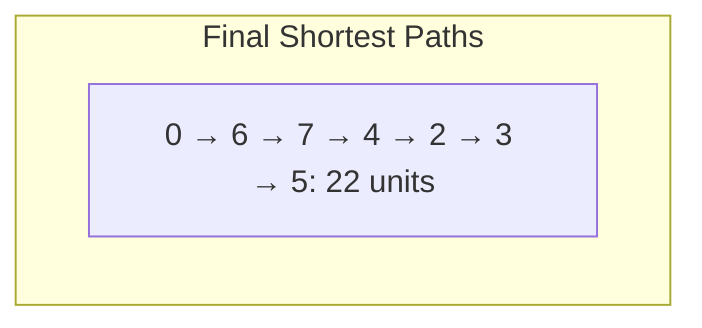
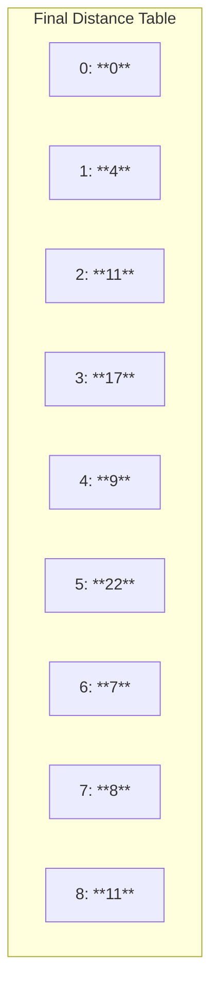

Dijkstra’s Algorithm with Case Study

Contextual Background of Author and comments on Dijkstra's Algorithm
My background spans from biopsychology research at UCSB—studying awe through VR experiences and memory induction through 'AWE' in a scientifically controlled setting—to now focusing on Computer Science.

The goal: build computational models simulating individuals and their perceptions.

A solid grasp of fundamental algorithms like Dijkstra’s provides a crucial foundation.

These approaches can be used in more complex simulations, personality/perception modeling, and eventually integrate them.
Objective:
Determine the shortest path from Node 0 to Node 5 in a weighted graph of 9 nodes (0 through 8). The graph’s edges have non-negative weights.


Final Shortest Path and Distances

Shortest Path Found:
0 → 6 → 7 → 4 → 2 → 3 → 5

Total Distance: 22 units

Distance Verification:
• 0 to 6: 7
• 6 to 7: 1 (Total: 8)
• 7 to 4: 1 (Total: 9)
• 4 to 2: 2 (Total: 11)
• 2 to 3: 6 (Total: 17)
• 3 to 5: 5 (Total: 22)

No shorter path exists given the graph’s structure.

Visual Representation of Results


Conceptual Enhancements:
	1.	Distance Array (D): Maintains the minimum known distance from the start node to each node.
	2.	Priority Queue (PQ): Holds nodes alongside their currently known shortest distance. It always extracts the node with the smallest tentative distance first.
	3.	Shortest Path Reconstruction (SP): A separate mapping (or array) that allows backtracking from a destination node to reconstruct the full shortest path. In a step-by-step diagram, we highlight path updates conceptually, showing which predecessor leads to the chosen node.

Improved Step-by-Step Sequence Diagram

Key Improvements in the Diagram:
	•	We explicitly show when neighbors are checked and how they affect both the D array and the PQ.
	•	We annotate updates to previousNodes (or SP) clearly.
	•	We ensure that at every “Process Node X” step, it’s clear which neighbors are examined and how their distances potentially get updated.

```mermaid
sequenceDiagram
    participant PQ as "Priority Queue"
    participant D as "Distance Array"
    participant SP as "Previous Nodes (for Path)"
    participant Graph as "Graph Structure"

    Note over D: Initialization
    D->>D: D[0] = 0
    D->>D: D[others] = ∞
    PQ->>PQ: Insert (0, distance=0)
    SP->>SP: SP is empty initially (no predecessors)

    rect rgb(200,255,200)
    Note over PQ: Process Node 0 (dist=0)
    PQ->>D: Extract node 0 with distance=0
    PQ->>Graph: Get neighbors of 0 => {1(w=4), 6(w=7)}
    D->>D: Update D[1]=4, D[6]=7
    SP->>SP: SP[1]=0, SP[6]=0 (0 is the predecessor of these nodes)
    PQ->>PQ: Insert (1,4), (6,7)
    end

    rect rgb(200,220,255)
    Note over PQ: Process Node 1 (dist=4)
    PQ->>D: Extract node 1 with distance=4
    PQ->>Graph: Get neighbors of 1 => {2(w=9),6(w=11),7(w=20)}
    D->>D: Check D[2], currently ∞, newDist=4+9=13 => D[2]=13
    SP->>SP: SP[2]=1
    PQ->>PQ: Insert (2,13)

    D->>D: Check D[6], currently 7, newDist=4+11=15 > 7 (no update)
    D->>D: Check D[7], currently ∞, newDist=4+20=24 => D[7]=24
    SP->>SP: SP[7]=1
    PQ->>PQ: Insert (7,24)
    PQ->>PQ: Current PQ: (6,7), (2,13), (7,24)
    end

    rect rgb(255,220,220)
    Note over PQ: Process Node 6 (dist=7)
    PQ->>D: Extract node 6 with distance=7
    PQ->>Graph: Get neighbors of 6 => {7(w=1)}
    D->>D: Check D[7], currently 24, newDist=7+1=8 => D[7]=8 (improvement!)
    SP->>SP: SP[7]=6 (update predecessor from 1 to 6)
    PQ->>PQ: Insert (7,8)
    end

    rect rgb(220,255,220)
    Note over PQ: Process Node 7 (dist=8)
    PQ->>D: Extract node 7 with distance=8
    PQ->>Graph: Get neighbors of 7 => {4(w=1),8(w=3)}
    D->>D: Check D[4], currently ∞, newDist=8+1=9 => D[4]=9
    SP->>SP: SP[4]=7
    PQ->>PQ: Insert (4,9)

    D->>D: Check D[8], currently ∞, newDist=8+3=11 => D[8]=11
    SP->>SP: SP[8]=7
    PQ->>PQ: Insert (8,11)

    PQ->>PQ: Current PQ: (4,9), (2,13), (8,11)
    end

    rect rgb(220,220,255)
    Note over PQ: Process Node 4 (dist=9)
    PQ->>D: Extract node 4 with distance=9
    PQ->>Graph: Get neighbors of 4 => {2(w=2),5(w=15),7(w=1),8(w=5)}
    D->>D: Check D[2], currently 13, newDist=9+2=11 => D[2]=11 (improved from 13)
    SP->>SP: SP[2]=4 (update predecessor from 1 to 4)
    PQ->>PQ: Insert (2,11)

    D->>D: Check D[5], currently ∞, newDist=9+15=24 => D[5]=24
    SP->>SP: SP[5]=4
    PQ->>PQ: Insert (5,24)

    D->>D: Check D[7], currently 8, newDist=9+1=10 > 8 (no update)
    D->>D: Check D[8], currently 11, newDist=9+5=14 > 11 (no update)

    PQ->>PQ: Current PQ now has (2,11), (8,11), (5,24), (2,13 no longer optimal)
    end

    rect rgb(255,255,220)
    Note over PQ: Process Node 2 (dist=11)
    PQ->>D: Extract node 2 with distance=11
    PQ->>Graph: Get neighbors of 2 => {3(w=6),4(w=2)}
    D->>D: Check D[3], currently ∞, newDist=11+6=17 => D[3]=17
    SP->>SP: SP[3]=2
    PQ->>PQ: Insert (3,17)

    D->>D: Check D[4], currently 9, newDist=11+2=13 > 9 (no update)

    PQ->>PQ: Current PQ: (8,11), (3,17), (5,24)
    end

    rect rgb(220,240,240)
    Note over PQ: Process Node 8 (dist=11)
    PQ->>D: Extract node 8 with distance=11
    PQ->>Graph: Get neighbors of 8 => {…}
    D->>D: Check neighbors no shorter paths found

    PQ->>PQ: Current PQ: (3,17), (5,24)
    end

    rect rgb(240,240,220)
    Note over PQ: Process Node 3 (dist=17)
    PQ->>D: Extract node 3 with distance=17
    PQ->>Graph: Get neighbors of 3 => {5(w=5),4(w=10)}
    D->>D: Check D[5], currently 24, newDist=17+5=22 => D[5]=22 (improvement!)
    SP->>SP: SP[5]=3 (update predecessor from 4 to 3)
    PQ->>PQ: Insert (5,22)

    D->>D: Check D[4], currently 9, newDist=17+10=27 > 9 (no update)

    PQ->>PQ: Current PQ: (5,22), (5,24 no longer relevant)
    end

    rect rgb(240,200,200)
    Note over PQ: Process Node 5 (dist=22)
    PQ->>D: Extract node 5 with distance=22
    PQ->>Graph: Get neighbors of 5 => {8(w=12)}
    D->>D: Check D[8], currently 11, newDist=22+12=34 > 11 (no update)

    PQ->>PQ: Empty
    Note over PQ: Algorithm terminates
    Note over SP: We can now reconstruct the shortest path using SP
    end
```



After the Algorithm:
	•	Distances Confirmed:
D = [0:0, 1:4, 2:11, 3:17, 4:9, 5:22, 6:7, 7:8, 8:11]
	•	Shortest Path to Node 5:
Backtrack using SP:
5 → 3 → 2 → 4 → 7 → 6 → 0 (reversed = 0 → 6 → 7 → 4 → 2 → 3 → 5)

Final Distance Table:

graph TD
subgraph Final Distance Table
DT0[0: **0**]
DT1[1: **4**]
DT2[2: **11**]
DT3[3: **17**]
DT4[4: **9**]
DT5[5: **22**]
DT6[6: **7**]
DT7[7: **8**]
DT8[8: **11**]
end

Shortest Path Graphically:



Detailed Step-by-Step Processing of Dijkstra’s Algorithm

Initialization:
• Distances: [0:0, 1:∞, 2:∞, 3:∞, 4:∞, 5:∞, 6:∞, 7:∞, 8:∞]
• Priority Queue (PQ): [(0,0)]

At each step, we: 1. Extract the node with the smallest distance from PQ. 2. “Relax” edges—check if the current path to each neighbor is shorter than previously recorded. 3. Update distances and PQ accordingly.


Java Code Implementation

Notes on “How” and “Why”:
• We use a PriorityQueue for efficient retrieval of the next closest node.
• HashMap structures store distances and graph edges.
• The algorithm’s correctness relies on relaxing edges and systematically exploring nodes with the smallest current distance first.

Performance & Security Considerations:
• Performance: PriorityQueue operations are O(log V), making this approach scalable for larger graphs.

• Security: Ensure no untrusted input directly modifies the graph structure. Validate all inputs if adapting for user-provided data.

• Low-level: Using arrays directly could be faster but less flexible. Current approach balances readability and efficiency.

• High-level: For extremely large graphs, consider more memory-efficient data structures or specialized shortest-path algorithms.

• Cybersecurity: No sensitive data is stored. In a real environment, ensure secure coding practices, handle exceptions gracefully, and avoid disclosing internal system states.

• Python/Mojo interoperability enables using results in numpy, networkx, or machine learning frameworks.
```

Step-by-Step Processing of Dijkstra’s Algorithm

1. Processing Node 0:
	•	Before:
	•	Distance Array: [0: **0**, 1: ∞, 2: ∞, 3: ∞, 4: ∞, 5: ∞, 6: ∞, 7: ∞, 8: ∞]
	•	Priority Queue: [(0, 0)]
	•	Action:
	•	Node 0 is dequeued from the Priority Queue.
	•	Neighbors of Node 0 (Nodes 1 and 6) are examined.
	•	Distance to Node 1: 0 (current) + 4 (edge) = 4
	•	Distance to Node 6: 0 (current) + 7 (edge) = 7
	•	After:
	•	Distance Array: [0: **0**, 1: **4**, 2: ∞, 3: ∞, 4: ∞, 5: ∞, 6: **7**, 7: ∞, 8: ∞]
	•	Priority Queue: [(1, 4), (6, 7)]

2. Processing Node 1:
	•	Before:
	•	Distance Array: [0: **0**, 1: **4**, 2: ∞, 3: ∞, 4: ∞, 5: ∞, 6: **7**, 7: ∞, 8: ∞]
	•	Priority Queue: [(1, 4), (6, 7)]
	•	Action:
	•	Node 1 is dequeued from the Priority Queue.
	•	Neighbors of Node 1 (Nodes 2, 6, and 7) are examined.
	•	Distance to Node 2: 4 (current) + 9 (edge) = 13
	•	Distance to Node 6: 4 (current) + 11 (edge) = 15 (No update since current distance is 7)
	•	Distance to Node 7: 4 (current) + 20 (edge) = 24
	•	After:
	•	Distance Array: [0: **0**, 1: **4**, 2: 13, 3: ∞, 4: ∞, 5: ∞, 6: **7**, 7: 24, 8: ∞]
	•	Priority Queue: [(6, 7), (2, 13), (7, 24)]
å
3. Processing Node 6:
	•	Before:
	•	Distance Array: [0: **0**, 1: **4**, 2: 13, 3: ∞, 4: ∞, 5: ∞, 6: **7**, 7: 24, 8: ∞]
	•	Priority Queue: [(6, 7), (2, 13), (7, 24)]
	•	Action:
	•	Node 6 is dequeued from the Priority Queue.
	•	Neighbors of Node 6 (Node 7) are examined.
	•	Distance to Node 7: 7 (current) + 1 (edge) = 8
	•	After:
	•	Distance Array: [0: **0**, 1: **4**, 2: 13, 3: ∞, 4: ∞, 5: ∞, 6: **7**, 7: **8**, 8: ∞]
	•	Priority Queue: [(7, 8), (2, 13), (8, 11)]

4. Processing Node 7:
	•	Before:
	•	Distance Array: [0: **0**, 1: **4**, 2: 13, 3: ∞, 4: ∞, 5: ∞, 6: **7**, 7: **8**, 8: ∞]
	•	Priority Queue: [(7, 8), (2, 13), (8, 11)]
	•	Action:
	•	Node 7 is dequeued from the Priority Queue.
	•	Neighbors of Node 7 (Nodes 4 and 8) are examined.
	•	Distance to Node 4: 8 (current) + 1 (edge) = 9
	•	Distance to Node 8: 8 (current) + 3 (edge) = 11
	•	After:
	•	Distance Array: [0: **0**, 1: **4**, 2: 13, 3: ∞, 4: **9**, 5: ∞, 6: **7**, 7: **8**, 8: **11**]
	•	Priority Queue: [(2, 13), (8, 11), (4, 9), (5, 24)]

5. Processing Node 4:
	•	Before:
	•	Distance Array: [0: **0**, 1: **4**, 2: 13, 3: ∞, 4: **9**, 5: ∞, 6: **7**, 7: **8**, 8: **11**]
	•	Priority Queue: [(2, 13), (8, 11), (4, 9), (5, 24)]
	•	Action:
	•	Node 4 is dequeued from the Priority Queue.
	•	Neighbors of Node 4 (Nodes 2, 5, and 8) are examined.
	•	Distance to Node 2: 9 (current) + 2 (edge) = 11 (Update from 13 to 11)
	•	Distance to Node 5: 9 (current) + 15 (edge) = 24
	•	Distance to Node 8: 9 (current) + 5 (edge) = 14 (No update since current distance is 11)
	•	After:
	•	Distance Array: [0: **0**, 1: **4**, 2: **11**, 3: ∞, 4: **9**, 5: 24, 6: **7**, 7: **8**, 8: **11**]
	•	Priority Queue: [(2, 11), (8, 11), (5, 24), (3, 15)]

6. Processing Node 2:
	•	Before:
	•	Distance Array: [0: **0**, 1: **4**, 2: **11**, 3: ∞, 4: **9**, 5: 24, 6: **7**, 7: **8**, 8: **11**]
	•	Priority Queue: [(2, 11), (8, 11), (5, 24), (3, 15)]
	•	Action:
	•	Node 2 is dequeued from the Priority Queue.
	•	Neighbors of Node 2 (Nodes 3 and 4) are examined.
	•	Distance to Node 3: 11 (current) + 6 (edge) = 17
	•	Distance to Node 4: 11 (current) + 10 (edge) = 21 (No update since current distance is 9)
	•	After:
	•	Distance Array: [0: **0**, 1: **4**, 2: **11**, 3: 17, 4: **9**, 5: 24, 6: **7**, 7: **8**, 8: **11**]
	•	Priority Queue: [(8, 11), (3, 17), (5, 24)]

7. Processing Node 8:
	•	Before:
	•	Distance Array: [0: **0**, 1: **4**, 2: **11**, 3: 17, 4: **9**, 5: 24, 6: **7**, 7: **8**, 8: **11**]
	•	Priority Queue: [(8, 11), (3, 17), (5, 24)]
	•	Action:
	•	Node 8 is dequeued from the Priority Queue.
	•	Neighbors of Node 8 (No outgoing edges in this context).
	•	After:
	•	Distance Array: [0: **0**, 1: **4**, 2: **11**, 3: 17, 4: **9**, 5: 24, 6: **7**, 7: **8**, 8: **11**]
	•	Priority Queue: [(3, 17), (5, 24)]

8. Processing Node 3:
	•	Before:
	•	Distance Array: [0: **0**, 1: **4**, 2: **11**, 3: 17, 4: **9**, 5: 24, 6: **7**, 7: **8**, 8: **11**]
	•	Priority Queue: [(3, 17), (5, 24)]
	•	Action:
	•	Node 3 is dequeued from the Priority Queue.
	•	Neighbors of Node 3 (Nodes 4 and 5) are examined.
	•	Distance to Node 4: 17 (current) + 10 (edge) = 27 (No update since current distance is 9)
	•	Distance to Node 5: 17 (current) + 5 (edge) = 22 (Update from 24 to 22)
	•	After:
	•	Distance Array: [0: **0**, 1: **4**, 2: **11**, 3: 17, 4: **9**, 5: 22, 6: **7**, 7: **8**, 8: **11**]
	•	Priority Queue: [(5, 22)]

9. Processing Node 5:
	•	Before:
	•	Distance Array: [0: **0**, 1: **4**, 2: **11**, 3: 17, 4: **9**, 5: 22, 6: **7**, 7: **8**, 8: **11**]
	•	Priority Queue: [(5, 22)]
	•	Action:
	•	Node 5 is dequeued from the Priority Queue.
	•	Neighbors of Node 5 (Node 8) are examined.
	•	Distance to Node 8: 22 (current) + 12 (edge) = 34 (No update since current distance is 11)
	•	After:
	•	Distance Array: [0: **0**, 1: **4**, 2: **11**, 3: 17, 4: **9**, 5: **22**, 6: **7**, 7: **8**, 8: **11**]
	•	Priority Queue: [] (Algorithm terminates as the Priority Queue is empty)

Final Distance Table:


Summary of Distance Updates:
	1.	Processing Node 0:
	•	Before: All nodes except Node 0 have distances of ∞.
	•	After: Distances updated for Nodes 1 (4) and 6 (7).
	2.	Processing Node 1:
	•	Before: Node 1 has a distance of 4.
	•	After: Distances updated for Node 2 (13) and Node 7 (24).
	3.	Processing Node 6:
	•	Before: Node 6 has a distance of 7.
	•	After: Distance updated for Node 7 (8).
	4.	Processing Node 7:
	•	Before: Node 7 has a distance of 8.
	•	After: Distances updated for Node 4 (9) and Node 8 (11).
	5.	Processing Node 4:
	•	Before: Node 4 has a distance of 9.
	•	After: Distance updated for Node 2 (11).
	6.	Processing Node 2:
	•	Before: Node 2 has a distance of 11.
	•	After: Distance updated for Node 3 (17).
	7.	Processing Node 8:
	•	Before: Node 8 has a distance of 11.
	•	After: No further updates.
	8.	Processing Node 3:
	•	Before: Node 3 has a distance of 17.
	•	After: Distance updated for Node 5 (22).
	9.	Processing Node 5:
	•	Before: Node 5 has a distance of 22.
	•	After: No further updates.

Final Shortest Path from Node 0 to Node 5:
	•	Path: 0 → 6 → 7 → 4 → 2 → 3 → 5
	•	Total Distance: 22 units


```java
import java.util.\*;

class Edge {
int dest; // destination node
int weight; // cost of traversal

    Edge(int dest, int weight) {
        this.dest = dest;
        this.weight = weight;
    }

}

class WeightedGraph {
private Map<Integer, List<Edge>> adjList = new HashMap<>();

    public void addEdge(int src, int dest, int weight) {
        // Add edge (src -> dest) with given weight
        adjList.computeIfAbsent(src, k -> new ArrayList<>()).add(new Edge(dest, weight));
    }

    public List<Edge> getEdges(int node) {
        // Retrieve all edges from this node
        return adjList.getOrDefault(node, new ArrayList<>());
    }

}

class Node implements Comparable<Node> {
int id;
int distance;

    Node(int id, int distance) {
        this.id = id;
        this.distance = distance;
    }

    @Override
    public int compareTo(Node other) {
        // Ensures the PriorityQueue orders by smallest distance first
        return Integer.compare(this.distance, other.distance);
    }

}

public class DijkstraExample {
public static Map<Integer, Integer> findShortestDistances(WeightedGraph graph, int start) {
Map<Integer, Integer> distances = new HashMap<>();
Map<Integer, Integer> previousNodes = new HashMap<>();
PriorityQueue<Node> pq = new PriorityQueue<>();

        // Initialize distances to ∞ except for the start node
        for (int node = 0; node < 9; node++) {
            distances.put(node, Integer.MAX_VALUE);
        }
        distances.put(start, 0);
        pq.offer(new Node(start, 0));

        while (!pq.isEmpty()) {
            Node current = pq.poll();
            int currentNode = current.id;
            int currentDist = current.distance;

            // If there's a better distance, skip this outdated entry
            if (currentDist > distances.get(currentNode)) continue;

            // Relax edges
            for (Edge edge : graph.getEdges(currentNode)) {
                int neighbor = edge.dest;
                int newDist = distances.get(currentNode) + edge.weight;
                if (newDist < distances.get(neighbor)) {
                    distances.put(neighbor, newDist);
                    previousNodes.put(neighbor, currentNode);
                    pq.offer(new Node(neighbor, newDist));
                }
            }
        }
        return distances; // Contains shortest distances from 'start' to every node
    }

    public static Map<Integer, Integer> findPreviousNodes(WeightedGraph graph, int start) {
        // Similar logic as findShortestDistances but we store 'previousNodes' to reconstruct path later
        Map<Integer, Integer> distances = new HashMap<>();
        Map<Integer, Integer> previousNodes = new HashMap<>();
        PriorityQueue<Node> pq = new PriorityQueue<>();

        for (int node = 0; node < 9; node++) {
            distances.put(node, Integer.MAX_VALUE);
        }
        distances.put(start, 0);
        pq.offer(new Node(start, 0));

        while (!pq.isEmpty()) {
            Node current = pq.poll();
            int currentNode = current.id;
            int currentDist = current.distance;

            if (currentDist > distances.get(currentNode)) continue;

            for (Edge edge : graph.getEdges(currentNode)) {
                int neighbor = edge.dest;
                int newDist = distances.get(currentNode) + edge.weight;
                if (newDist < distances.get(neighbor)) {
                    distances.put(neighbor, newDist);
                    previousNodes.put(neighbor, currentNode);
                    pq.offer(new Node(neighbor, newDist));
                }
            }
        }
        return previousNodes;
    }

    public static List<Integer> reconstructPath(Map<Integer, Integer> previousNodes, int start, int end) {
        // Build the path by backtracking through 'previousNodes'
        List<Integer> path = new ArrayList<>();
        Integer current = end;
        while (current != null && current != start) {
            path.add(current);
            current = previousNodes.get(current);
        }
        if (current == null) {
            return Collections.emptyList(); // no path
        }
        path.add(start);
        Collections.reverse(path);
        return path;
    }

    public static void main(String[] args) {
        WeightedGraph graph = new WeightedGraph();

        // Define the graph edges
        graph.addEdge(0, 1, 4);
        graph.addEdge(0, 6, 7);
        graph.addEdge(1, 2, 9);
        graph.addEdge(1, 6, 11);
        graph.addEdge(1, 7, 20);
        graph.addEdge(2, 3, 6);
        graph.addEdge(2, 4, 2);
        graph.addEdge(3, 5, 5);
        graph.addEdge(3, 4, 10);
        graph.addEdge(4, 5, 15);
        graph.addEdge(4, 7, 1);
        graph.addEdge(4, 8, 5);
        graph.addEdge(5, 8, 12);
        graph.addEdge(6, 7, 1);
        graph.addEdge(7, 8, 3);

        int startNode = 0;
        int endNode = 5;

        Map<Integer, Integer> distances = findShortestDistances(graph, startNode);
        Map<Integer, Integer> previousNodes = findPreviousNodes(graph, startNode);
        List<Integer> shortestPath = reconstructPath(previousNodes, startNode, endNode);

        System.out.println("Shortest distances from node " + startNode + ":");
        for (Map.Entry<Integer, Integer> entry : distances.entrySet()) {
            System.out.println("Node " + entry.getKey() + ": " + entry.getValue());
        }

        System.out.println("\nShortest path from node " + startNode + " to node " + endNode + ": "
                           + shortestPath + " with total distance: " + distances.get(endNode));
    }

}
```
