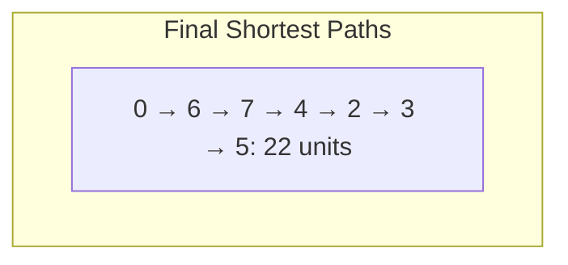

Dijkstra’s Algorithm with Case Study

Contextual Background:
My background spans from biopsychology research at UCSB—studying awe through VR experiences and memory induction through 'AWE'∫ in a scientifically controlled setting—to now focusing on Computer Science.

The goal: build computational models simulating individuals and their perceptions.

A solid grasp of fundamental algorithms like Dijkstra’s provides a crucial foundation. You can then use these approaches in more complex simulations, personality/perception modeling, and eventually integrate them.

Objective:
Determine the shortest path from Node 0 to Node 5 in a weighted graph of 9 nodes (0 through 8). The graph’s edges have non-negative weights.

Final Shortest Path and Distances

Shortest Path Found:
0 → 6 → 7 → 4 → 2 → 3 → 5

Total Distance: 22 units

Distance Verification:
• 0 to 6: 7
• 6 to 7: 1 (Total: 8)
• 7 to 4: 1 (Total: 9)
• 4 to 2: 2 (Total: 11)
• 2 to 3: 6 (Total: 17)
• 3 to 5: 5 (Total: 22)

No shorter path exists given the graph’s structure.

Visual Representation of Results

Final Distance Table:

graph TD
subgraph Final Distance Table
DT0[0: **0**]
DT1[1: **4**]
DT2[2: **11**]
DT3[3: **17**]
DT4[4: **9**]
DT5[5: **22**]
DT6[6: **7**]
DT7[7: **8**]
DT8[8: **11**]
end

Shortest Path Graphically:

Detailed Step-by-Step Processing of Dijkstra’s Algorithm

Initialization:
• Distances: [0:0, 1:∞, 2:∞, 3:∞, 4:∞, 5:∞, 6:∞, 7:∞, 8:∞]
• Priority Queue (PQ): [(0,0)]

At each step, we: 1. Extract the node with the smallest distance from PQ. 2. “Relax” edges—check if the current path to each neighbor is shorter than previously recorded. 3. Update distances and PQ accordingly.

```mermaid
sequenceDiagram
    participant PQ as "Priority Queue"
    participant D as "Distance Array"
    participant SP as "Shortest Path"

    Note right of PQ: Initialization
    Note right of D: Setting initial distances
    Note right of SP: Tracking path
    PQ->>D: distance[0] = 0, others = ∞
    SP->>SP: Path = [0]
    PQ->>PQ: Insert (0,0)

    rect rgb(200, 255, 200)
        Note over PQ: Process Node 0 (dist: 0)
        PQ->>D: Update neighbors: Node 1 (0+4=4), Node 6 (0+7=7)
        SP->>SP: Update path options: [0,1], [0,6]
        Note over D: [0:0, 1:4, 6:7, others ∞]
        PQ->>PQ: (1,4), (6,7)
    end

    rect rgb(200, 220, 255)
        Note over PQ: Process Node 1 (dist:4)
        PQ->>D: Update neighbors
        Note over D: Node 2: 4+9=13<br/>Node 6: 4+11=15 (no improvement)<br/>Node 7: 4+20=24
        SP->>SP: Update path options: [0,1,2], [0,1,6], [0,1,7]
        Note over D: [0:0,1:4,2:13,6:7,7:24, others ∞]
        PQ->>PQ: (6,7), (2,13), (7,24)
    end

    rect rgb(255, 220, 220)
        Note over PQ: Process Node 6 (dist:7)
        PQ->>D: Update neighbor (7: 7+1=8)
        SP->>SP: Path = [0,6,7]
        Note over D: [0:0,1:4,2:13,6:7,7:8, others ∞]
        PQ->>PQ: (7,8), (2,13)
    end

    rect rgb(220, 255, 220)
        Note over PQ: Process Node 7 (dist:8)
        PQ->>D: Update neighbors
        Note over D: Node 4: 8+1=9<br/>Node 8: 8+3=11
        SP->>SP: Path = [0,6,7,4]
        Note over D: [0:0,1:4,2:13,4:9,6:7,7:8,8:11, others ∞]
        PQ->>PQ: (4,9), (2,13), (8,11)
    end

    rect rgb(220, 220, 255)
        Note over PQ: Process Node 4 (dist:9)
        PQ->>D: Update neighbors
        Note over D: Node 2: min(13, 9+2=11) => 11<br/>Node 5: 9+15=24 (tentative)<br/>Node 8: min(11, 9+5=14) => no improvement
        SP->>SP: Path = [0,6,7,4,2]
        Note over D: [0:0,1:4,2:11,3:∞,4:9,5:24,6:7,7:8,8:11]
        PQ->>PQ: (2,11), (8,11), (5,24)
    end

    rect rgb(255, 255, 220)
        Note over PQ: Process Node 2 (dist:11)
        PQ->>D: Update neighbors
        Note over D: Node 3: 11+6=17<br/>Node 4: no improvement (9 is better than 11+10=21)
        SP->>SP: Path = [0,6,7,4,2,3]
        Note over D: [0:0,1:4,2:11,3:17,4:9,5:24,6:7,7:8,8:11]
        PQ->>PQ: (3,17), (5,24), (8,11)
    end

    rect rgb(220, 240, 240)
        Note over PQ: Process Node 8 (dist:11)
        PQ->>D: Check neighbors - no improvements
        Note over D: [0:0,1:4,2:11,3:17,4:9,5:24,6:7,7:8,8:11]
        PQ->>PQ: (3,17), (5,24)
    end

    rect rgb(240, 240, 220)
        Note over PQ: Process Node 3 (dist:17)
        PQ->>D: Update neighbors
        Note over D: Node 4: no improvement (9 is better than 17+10=27)<br/>Node 5: min(24,17+5=22) => 22
        SP->>SP: Path = [0,6,7,4,2,3,5]
        Note over D: [0:0,1:4,2:11,3:17,4:9,5:22,6:7,7:8,8:11]
        PQ->>PQ: (5,22)
    end

    rect rgb(240, 200, 200)
        Note over PQ: Process Node 5 (dist:22)
        PQ->>D: Check neighbors (8)
        Note over D: No improvement since 11 < 22+12=34
        Note over PQ: Algorithm ends
        SP->>SP: Final Path = [0,6,7,4,2,3,5]
    end
```

Final Distances: [0:0,1:4,2:11,3:17,4:9,5:22,6:7,7:8,8:11]
We have confirmed the shortest path to Node 5 is indeed 22.

Java Code Implementation With Comments

Notes on “How” and “Why”:
• We use a PriorityQueue for efficient retrieval of the next closest node.
• HashMap structures store distances and graph edges.
• The algorithm’s correctness relies on relaxing edges and systematically exploring nodes with the smallest current distance first.

Performance & Security Considerations:
• Performance: PriorityQueue operations are O(log V), making this approach scalable for larger graphs.
• Security: Ensure no untrusted input directly modifies the graph structure. Validate all inputs if adapting for user-provided data.
• Low-level: Using arrays directly could be faster but less flexible. Current approach balances readability and efficiency.
• High-level: For extremely large graphs, consider more memory-efficient data structures or specialized shortest-path algorithms.
• Cybersecurity: No sensitive data is stored. In a real environment, ensure secure coding practices, handle exceptions gracefully, and avoid disclosing internal system states.

Integration With Conda and ML Tools:
• After mastering Dijkstra’s, you could model user navigation paths in VR simulations as features for ML models.
• Use conda to create a controlled environment for dependencies.
• Python interoperability enables using results in numpy, networkx, or machine learning frameworks.

import java.util.\*;

class Edge {
int dest; // destination node
int weight; // cost of traversal

    Edge(int dest, int weight) {
        this.dest = dest;
        this.weight = weight;
    }

}

class WeightedGraph {
private Map<Integer, List<Edge>> adjList = new HashMap<>();

    public void addEdge(int src, int dest, int weight) {
        // Add edge (src -> dest) with given weight
        adjList.computeIfAbsent(src, k -> new ArrayList<>()).add(new Edge(dest, weight));
    }

    public List<Edge> getEdges(int node) {
        // Retrieve all edges from this node
        return adjList.getOrDefault(node, new ArrayList<>());
    }

}

class Node implements Comparable<Node> {
int id;
int distance;

    Node(int id, int distance) {
        this.id = id;
        this.distance = distance;
    }

    @Override
    public int compareTo(Node other) {
        // Ensures the PriorityQueue orders by smallest distance first
        return Integer.compare(this.distance, other.distance);
    }

}

public class DijkstraExample {
public static Map<Integer, Integer> findShortestDistances(WeightedGraph graph, int start) {
Map<Integer, Integer> distances = new HashMap<>();
Map<Integer, Integer> previousNodes = new HashMap<>();
PriorityQueue<Node> pq = new PriorityQueue<>();

        // Initialize distances to ∞ except for the start node
        for (int node = 0; node < 9; node++) {
            distances.put(node, Integer.MAX_VALUE);
        }
        distances.put(start, 0);
        pq.offer(new Node(start, 0));

        while (!pq.isEmpty()) {
            Node current = pq.poll();
            int currentNode = current.id;
            int currentDist = current.distance;

            // If there's a better distance, skip this outdated entry
            if (currentDist > distances.get(currentNode)) continue;

            // Relax edges
            for (Edge edge : graph.getEdges(currentNode)) {
                int neighbor = edge.dest;
                int newDist = distances.get(currentNode) + edge.weight;
                if (newDist < distances.get(neighbor)) {
                    distances.put(neighbor, newDist);
                    previousNodes.put(neighbor, currentNode);
                    pq.offer(new Node(neighbor, newDist));
                }
            }
        }
        return distances; // Contains shortest distances from 'start' to every node
    }

    public static Map<Integer, Integer> findPreviousNodes(WeightedGraph graph, int start) {
        // Similar logic as findShortestDistances but we store 'previousNodes' to reconstruct path later
        Map<Integer, Integer> distances = new HashMap<>();
        Map<Integer, Integer> previousNodes = new HashMap<>();
        PriorityQueue<Node> pq = new PriorityQueue<>();

        for (int node = 0; node < 9; node++) {
            distances.put(node, Integer.MAX_VALUE);
        }
        distances.put(start, 0);
        pq.offer(new Node(start, 0));

        while (!pq.isEmpty()) {
            Node current = pq.poll();
            int currentNode = current.id;
            int currentDist = current.distance;

            if (currentDist > distances.get(currentNode)) continue;

            for (Edge edge : graph.getEdges(currentNode)) {
                int neighbor = edge.dest;
                int newDist = distances.get(currentNode) + edge.weight;
                if (newDist < distances.get(neighbor)) {
                    distances.put(neighbor, newDist);
                    previousNodes.put(neighbor, currentNode);
                    pq.offer(new Node(neighbor, newDist));
                }
            }
        }
        return previousNodes;
    }

    public static List<Integer> reconstructPath(Map<Integer, Integer> previousNodes, int start, int end) {
        // Build the path by backtracking through 'previousNodes'
        List<Integer> path = new ArrayList<>();
        Integer current = end;
        while (current != null && current != start) {
            path.add(current);
            current = previousNodes.get(current);
        }
        if (current == null) {
            return Collections.emptyList(); // no path
        }
        path.add(start);
        Collections.reverse(path);
        return path;
    }

    public static void main(String[] args) {
        WeightedGraph graph = new WeightedGraph();

        // Define the graph edges
        graph.addEdge(0, 1, 4);
        graph.addEdge(0, 6, 7);
        graph.addEdge(1, 2, 9);
        graph.addEdge(1, 6, 11);
        graph.addEdge(1, 7, 20);
        graph.addEdge(2, 3, 6);
        graph.addEdge(2, 4, 2);
        graph.addEdge(3, 5, 5);
        graph.addEdge(3, 4, 10);
        graph.addEdge(4, 5, 15);
        graph.addEdge(4, 7, 1);
        graph.addEdge(4, 8, 5);
        graph.addEdge(5, 8, 12);
        graph.addEdge(6, 7, 1);
        graph.addEdge(7, 8, 3);

        int startNode = 0;
        int endNode = 5;

        Map<Integer, Integer> distances = findShortestDistances(graph, startNode);
        Map<Integer, Integer> previousNodes = findPreviousNodes(graph, startNode);
        List<Integer> shortestPath = reconstructPath(previousNodes, startNode, endNode);

        System.out.println("Shortest distances from node " + startNode + ":");
        for (Map.Entry<Integer, Integer> entry : distances.entrySet()) {
            System.out.println("Node " + entry.getKey() + ": " + entry.getValue());
        }

        System.out.println("\nShortest path from node " + startNode + " to node " + endNode + ": "
                           + shortestPath + " with total distance: " + distances.get(endNode));
    }

}
